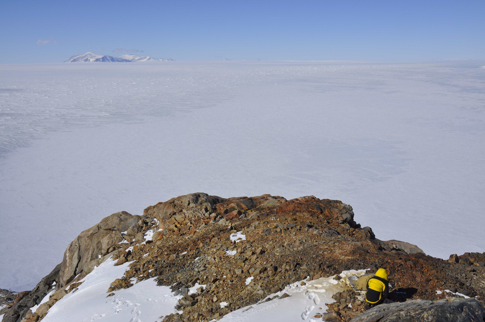
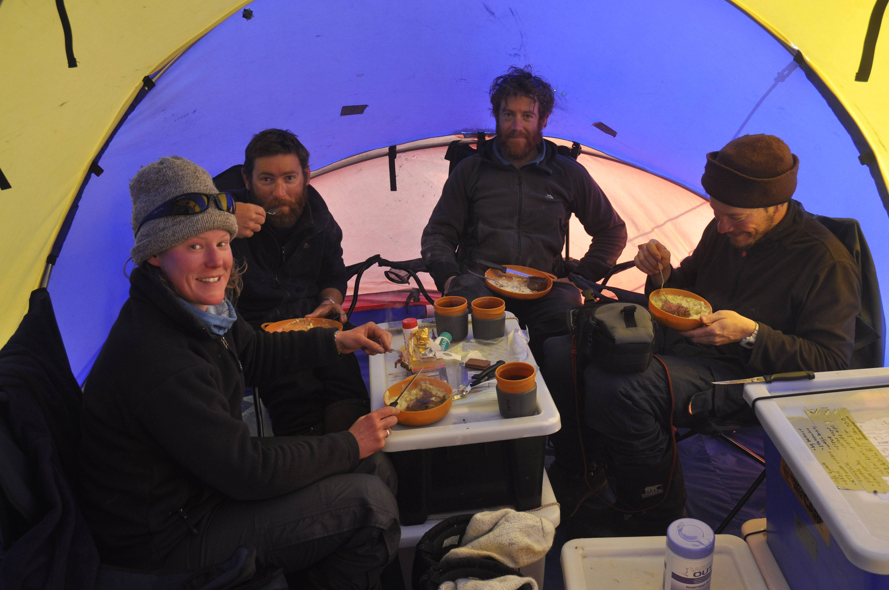
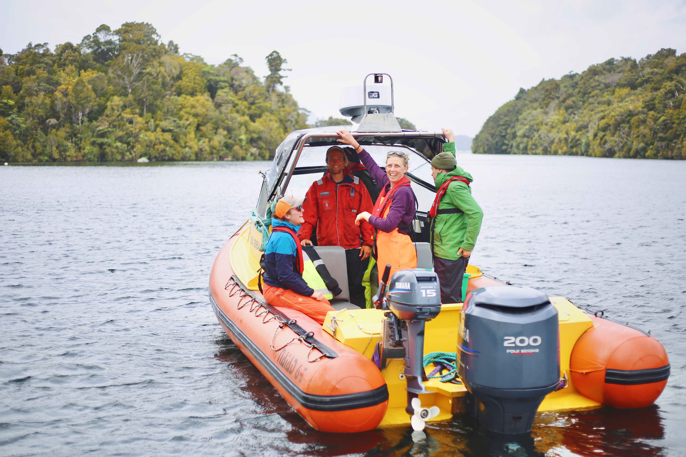
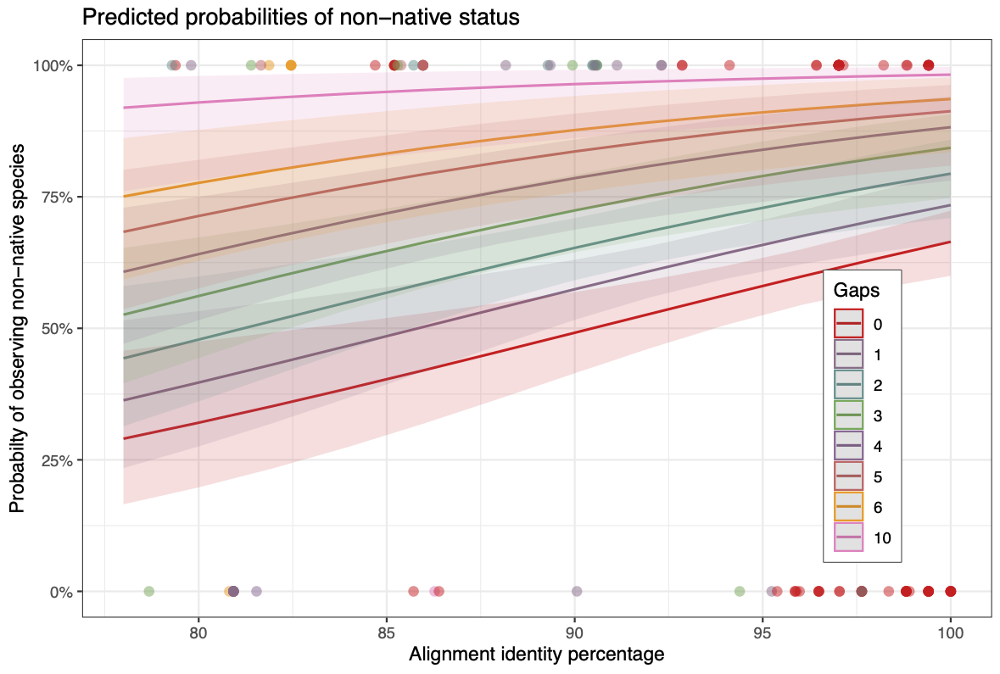
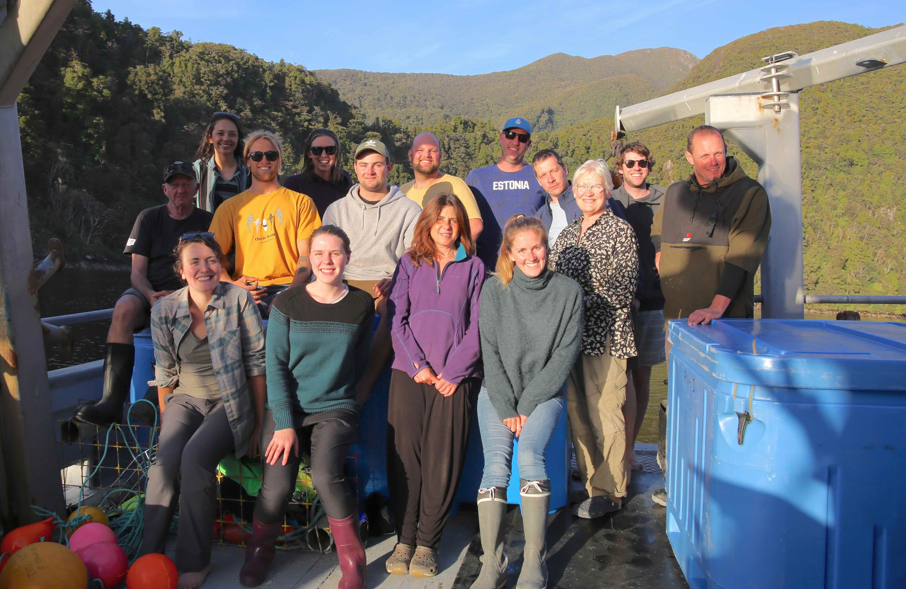

# Code compendium

**Paul Czechowski** <a
    id="cy-effective-orcid-url"
    class="underline"
     href="https://orcid.org/0000-0001-7894-4042"
     target="orcid.widget"
     rel="me noopener noreferrer"
     style="vertical-align: top">
     
      https://orcid.org/0000-0001-7894-4042
    </a>

I provide two **recent samples of my existing work** concerning [environmental DNA analysis](https://en.wikipedia.org/wiki/Environmental_DNA) in the [Prince Charles Mountains](https://en.wikipedia.org/wiki/Prince_Charles_Mountains) and [Fiordland](https://en.wikipedia.org/wiki/Fiordland). Alongside code comments and structure I include brief remarks on the both projects. Beyond **this text** note further cross-references:

* Code is accessible via individual [Github](https://github.com/macrobiotus) links.
* Further supplemental materials are available via individual permanently stored archives at [Zenodo](https://zenodo.org/)
* Corresponding article pre-prints are linked below, on [Bioxiv](https://www.biorxiv.org/search/author1%3APaul%2BCzechowski%20jcode%3Abiorxiv%20numresults%3A10%20sort%3Arelevance-rank%20format_result%3Astandard)

Code for both described projects was listed on my original EHA application. Further examples can be made available, e.g. for environmental DNA analyses [related to NSF-funded work](https://www.nsf.gov/awardsearch/showAward?AWD_ID=1748389&HistoricalAwards=false) and [ancient genome assembly](https://en.wikipedia.org/wiki/Ancient_DNA). 

## Example 1 – Antarctica

[_Antarctic biodiversity predictions through substrate qualities and environmental DNA_](https://www.biorxiv.org/content/10.1101/2021.08.18.456862v1).

### Background and motivation

The Prince Charles Mountains are some of the most remote ice-free areas in Antarctica, and Australia is dedicated to implementing new technologies for safeguarding Antarcticas's biodiversity. 

I started this new analysis of my Antarctic data during  New Zealand's first lockdown ([31 March 2020](https://covid19.govt.nz/about-our-covid-19-response/history-of-the-covid-19-alert-system/)). The resulting article is in production at   ESA's well-regarded [Frontiers in Ecology and the Environment](https://www.esa.org/frontiers-in-ecology-and-the-environment/).

In this project I investigate the distribution of cryptic Antarctic invertebrates living in remote island-like terrestrial habitats of Antarctica in relation to soil geochemical and mineral properties of their substrate. I found neutral substrate pH, low conductivity, and some substrate minerals to be important predictors of presence for basidiomycetes, chlorophytes, ciliophorans, nematodes, or tardigrades. We collected soils in the [Prince Charles Mountains](https://en.wikipedia.org/wiki/Prince_Charles_Mountains), I analyzed soil environmental DNA at the [Australian Centre for Ancient DNA](https://www.adelaide.edu.au/acad/). Soil geochemical variables were measured by [APAL](https://www.apal.com.au/). I collected X-ray diffraction spectra in collboration with Duanne White at the [University of Canberra](https://www.canberra.edu.au/). Funding was acquired by Mark Stevens (South Australian Museum)



_Field work at Mt. Menzies_

### [Code access](https://github.com/macrobiotus/pcm-eukaryotes-) and remarks

Files listed below and discussed here are available via [Github](https://github.com/macrobiotus/pcm-eukaryotes-). My analysis initially checks the suitability of the employed PCR primers (```000_r_in_silico_pcr.R```, with the [R](https://www.r-project.org/) language). Subsequently, various tools are used for quality check and quality filtering of data. I use [Bash](https://www.gnu.org/software/bash/), initially for metadata assembly (e.g. ```090_bash_create_manifests.sh``` ), and then to combine purposeful features of  [Qiime](https://qiime2.org/) 1 and 2 with software such as [Cutadapt](https://cutadapt.readthedocs.io/en/stable/), [Gnuplot](http://www.gnuplot.info/), [Blast](https://blast.ncbi.nlm.nih.gov/Blast.cgi), and [FastTree](http://www.microbesonline.org/fasttree/).  Denoising is implemented via [DADA2](https://benjjneb.github.io/dada2/tutorial.html) in  [Qiime](https://qiime2.org/) (```110_q2_denoise.sh```). Blast output can be inspected with [MEGAN](https://uni-tuebingen.de/fakultaeten/mathematisch-naturwissenschaftliche-fakultaet/fachbereiche/informatik/lehrstuehle/algorithms-in-bioinformatics/software/megan6/). Custom analysis steps (predominantly scripts with numbers higher than ```180...``` ) are implemented using [R](https://www.r-project.org/). 

I give a most detailed description of the works entire analysis history in the projects [README.md](https://github.com/macrobiotus/pcm-eukaryotes-/blob/master/README.md). In this file I included commit hashes to easily revert to  earlier code versions. Scripts ought to be run in consecutive order as indicated by their preceding number codes. Additional information, and imagery, as well as a snapshot of the project code at time of pre-print submission I provided via [Zenodo](https://doi.org/10.5281/zenodo.4579840).

```
.
├── 000_r_in_silico_pcr.R
├── 050_q1_demultiplex.sh
├── 060_q1_split_samples.sh
├── 070_bash_check_quality.sh
├── 080_bash_cutadapt.sh
├── 090_bash_create_manifests.sh
├── 100_q2_import.sh
├── 110_q2_denoise.sh
├── 115_gnu_plot_denoise_plate1.gnu
├── 115_gnu_plot_denoise_plate2.gnu
├── 120_q2_merge.sh
├── 130_q2_summary.sh
├── 140_bash_fasta_blast.sh
├── 150_r_get_q2_tax-tab.r
├── 165_r_prep_q2_predictor-tab_with-raster.r
├── 170_q2_summary.sh
├── 175_q2_seq_align.sh
├── 177_q2_mask_align.sh
├── 180_q2_get_fastree.sh
├── 190_q2_export_objects.sh
├── 200_r_get_phyloseq.r
├── 220_r_check_species_occurences.r
├── 230_r_add_blast_scores_to_som.r
└── README.md
```



_Thanks to Fiona, Tessa, Nick, Adrian, Josh, and Mark Stevens_ 

## Example 2 - Oceania

[_Environmental DNA analysis needs local reference data to inform taxonomy-based conservation policy – A case study from Aotearoa / New Zealand_](https://www.biorxiv.org/content/10.1101/2021.10.22.465527v1)

### Background and motivation

Fishing is one of the biggest industries in New Zealand, and Fiordland is an UNESCO world heritage site very important for the replenishment of New Zealand fish stocks. The analysis of environmental DNA with regards to fish was motivated by a request of the New Zealand Department of Conservation (Monique Ladds) to explore suitability of recent molecular biological approaches to assesses biodiversity of fish in marine reserves.

I started this analysis in addition to the sequencing of the [Haast's eagle](https://en.wikipedia.org/wiki/Haast%27s_eagle) genome  at the beginning of my PostDoc at the [University of Otago](https://www.otago.ac.nz/). The article is in review at SCB [Conservation Science and Practice](https://conbio.onlinelibrary.wiley.com/journal/25784854?tabActivePane=undefined).

In this project I evaluated the impact of lacking environmental DNA reference data on descriptions of the Fiordland fish biodiversity I compared eDNA-derived species identifications against Baited Remote Underwater Video (BRUV) data collected at the same time and locations as the eDNA data. Furthermore, I cross referenced both eDNA and BRUV data against species lists for the same region obtained from literature surveys and the Ocean Biodiversity Information System (OBIS).  Concordance of taxonomies between the data sources dissolved with lowering taxonomic levels, most decisively so for eDNA data. The work was entirely realized at the [University of Otago](https://www.otago.ac.nz/), lead by me, in collaboration with researchers of the Department of Marine Sciences (Chris Hepburn, Will Rayment), and the Department of Biostatistics (Michel de Lange). Funding was acquired by Michael Knapp (Otago University)



During review, an often-overlooked aspect of this analysis has been the detailed alignment-level analysis of species misidentifications, at a level that is uncommon in other eDNA studies. It is absolutely crucial to have detailed reference data for species level biodiversity surveys. 



_Summary of binomial regression. Regression analysis of the 142 non-unique eDNA observations (Tjur's R2 0.027) suggested each additional alignment gap to be associated with a 39% increased probability of observing a non-native species (Odds Ratio 1.39, 95% CI from 1.19 to 1.66, p <0.01). At the same time, a 1% increase in alignment concordance was associated with a 7% increased probability of non-native observation (OR 1.07, 95% CI 1.03 - 1.12, p <0.01)._

### [Code access](https://github.com/macrobiotus/Fiordland-eDNA) and remarks

All scripts used for analysis, and listed below  are available via [Github](https://github.com/macrobiotus/Fiordland-eDNA). Similar to my aforementioned project, I started by evaluating primer suitability (```000_r_in_silico_pcr.R```), read in metadata from Excel sheets and stored them as R data objects ( ```200_r_metadata_management.R```), checked and cleaned data for analysis (from ```300_bash_cutadapt_demultiplex.sh``` to ```980_q2_export_objects.sh```), and implemented project specific analysis steps  (using R from ```990_r_get_eDNA_long_table.r``` to ```998_r_summarize_results.r``` ). An effortful task was the retrieval, formatting and mapping of data from OBIS (in ```998_r_get_OBIS_and_map.r```). As usual, Blast output can be inspected with [MEGAN](https://uni-tuebingen.de/fakultaeten/mathematisch-naturwissenschaftliche-fakultaet/fachbereiche/informatik/lehrstuehle/algorithms-in-bioinformatics/software/megan6/).

The repository's [README.md](https://github.com/macrobiotus/Fiordland-eDNA#readme) file gives a comprehensive overview over the project history. I include commit hashes to enable easily going back to an earlier code version. Scripts ought to be run in consecutive order as indicated by their preceding number codes.

Additional information, and imagery, as well as a snapshot of the project code at time of pre-print submission are available via [Zenodo](https://doi.org/10.5281/zenodo.4638297).

```
.
├── 000_r_in_silico_pcr.R
├── 100_r_quantification_analysis.R
├── 200_r_metadata_management.R
├── 300_bash_cutadapt_demultiplex.sh
├── 350_bash_count_reads_and_mv_empty_fastqs.sh
├── 400_r_qiime_manifest.R
├── 500_q2_import.sh
├── 600_q2_denoise.sh
├── 650_r_plot_denoise.R
├── 750_bash_fasta_blast.sh
├── 800_r_get_q2_tax-tab.r
├── 850_r_prep_q2_predictor-tab.r
├── 900_q2_summary.sh
├── 980_q2_export_objects.sh
├── 990_r_get_eDNA_long_table.r
├── 995_r_get_BRUV_long_table.r
├── 995_r_get_PUBL_long_table.r
├── 997_r_format_longtables.r
├── 998_r_get_OBIS_and_map.r
├── 998_r_summarize_results.r
├── 999_get_package_citations.R
├── 999_r_mdl-makeBarPlots_310721.R
└── README.md
```


_Thanks to the divers of the Department of Marine Sciences of the University of Otago, Prof. Chris Hepburn, and our skipper Pete._